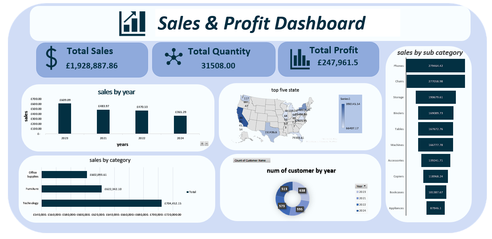

# 📊 Excel Sales Dashboard

## 📌 Project Overview
This project presents an interactive Excel Sales Dashboard designed to analyze sales performance and provide actionable business insights. The dashboard helps users monitor key performance indicators (KPIs), identify sales trends, and evaluate regional and product performance.

---

## 🎯 Objectives
- Analyze sales performance
- Track business KPIs
- Identify top-performing products
- Monitor regional performance
- Support data-driven decision making

---

## 📈 Dashboard Visualizations

### 📊 Sales Dashboard

This dashboard provides an overview of business performance through interactive charts and KPI cards.

### Key Metrics
- 💰 Total Sales
- 💵 Total Profit
- 📦 Total Quantity
- 📊 Average Sales

### Key Insights
- Identified the highest-performing products.
- Compared sales across different regions.
- Tracked yearly sales trends.
- Analyzed customer purchasing behavior.

---

## 🖼 Dashboard Preview

---

## 🛠 Tools Used
- Microsoft Excel
- Pivot Tables
- Pivot Charts
- Slicers
- Conditional Formatting

---

## 📂 Files Included
- 📄 Sales Data.xlsx
- 🖼 Dashboard.png
- 📖 README.md

---

## 👤 Author
**Omar Khaled**

Aspiring Data Analyst passionate about transforming data into actionable insights.
